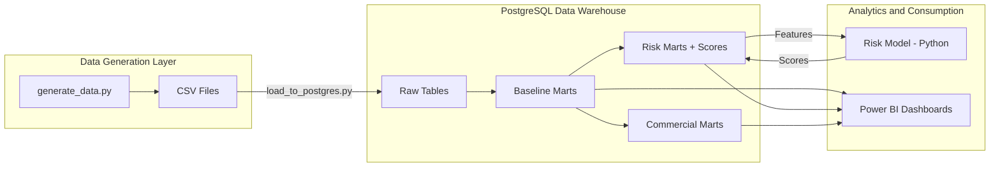
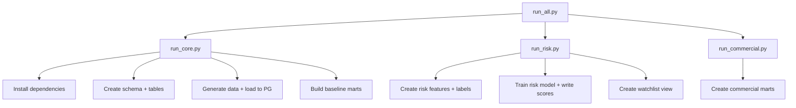

# Architecture

## Overview

The platform follows a three-layer architecture: **data generation** produces synthetic loan portfolio data, **PostgreSQL** stores and transforms it through a layered mart structure, and **Power BI** consumes the marts for interactive dashboards.

## Layer Descriptions

### 1. Data Generation (Python)

`core/python/generate_data.py` creates a realistic synthetic lending portfolio:

- **8,000 customers** with NZ-realistic demographics (age, income, region, credit score)
- **12,000 loans** across Personal, Auto, Mortgage, and SME products
- Full **amortisation schedules** using standard annuity calculations
- **Payment histories** with risk-driven late payment and miss probabilities
- **Collections events** for missed payments (SMS, call, email, agent, hardship)

Risk behaviour is modelled via a sigmoid function of borrower credit quality, income, product risk tier, and channel risk multiplier, ensuring the synthetic data has realistic delinquency patterns.

### 2. PostgreSQL Data Warehouse

All tables live in the `loan_analytics` schema. The warehouse follows a Kimball-style star schema:

| Layer | Tables / Views | Purpose |
|---|---|---|
| Raw | `dim_customers`, `dim_products`, `dim_channels`, `fct_loans`, `fct_schedule`, `fct_payments`, `fct_collections` | Source-of-record tables loaded from CSV |
| Baseline marts | `mart_loan_due_paid`, `mart_loan_arrears`, `mart_loan_dpd_bucket`, `mart_portfolio_snapshot`, `mart_portfolio_snapshot_v2`, `mart_dpd_migration`, `mart_vintage_60plus` | Core analytical views: DPD bucketing, migration, vintage analysis, EOP balance |
| Risk marts | `risk_pay_behaviour_monthly`, `risk_features_3m`, `risk_labels_60p_3m`, `risk_scores`, `risk_watchlist` | Feature engineering, model labels, scored watchlist |
| Commercial marts | `comm_interest_income_monthly`, `comm_nii_monthly`, `comm_rar_monthly` | Revenue, NII, and risk-adjusted return estimates |

Views are created sequentially via SQL scripts (`01_` -> `03_` -> `10_` / `20_`), maintaining clear dependency order.

### 3. Risk Model (Python / scikit-learn)

`package_risk/python/train_risk_model.py` trains a logistic regression classifier to predict whether a loan will enter 60+ DPD within 3 months. Features are pulled from `risk_features_3m`, and scores are written back to `risk_scores`.

See [Risk Methodology](methodology_risk.md) for full details.

### 4. Power BI Consumption

Power BI connects to PostgreSQL via DirectQuery or Import and uses the `mart_portfolio_snapshot_v2` view as the central fact table. DAX measures for each package are defined in:

- `package_risk/powerbi/measures_dax.md`
- `package_commercial/powerbi/measures_dax.md`

## Technology Choices

| Component | Technology | Rationale |
|---|---|---|
| Database | PostgreSQL 13+ | Industry standard, free, widely supported by BI tools |
| Data generation | Python (pandas, numpy) | Flexible synthetic data with controllable risk parameters |
| ML model | scikit-learn (LogisticRegression) | Interpretable, auditable, appropriate for binary classification |
| Visualisation | Power BI | Industry standard in financial services for stakeholder reporting |
| Orchestration | Python scripts (`run_all.py`) | Simple, no external scheduler dependency |

## Execution Flow

Each step is idempotent: `CREATE OR REPLACE VIEW` and `IF NOT EXISTS` allow safe re-runs.
