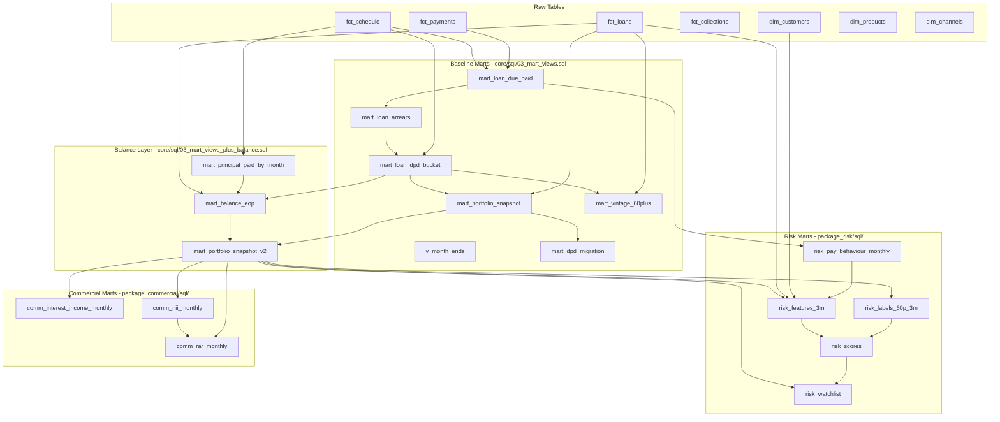

# Data Lineage

## Overview

Data flows through four layers: **raw tables** (loaded from CSV), **baseline marts** (core analytical views), **package marts** (risk and commercial), and **scored outputs**. Each layer depends only on the layers above it.

## Lineage Diagram

## Layer-by-Layer Detail

### Layer 1: Raw Tables

Loaded from CSV files by `core/python/load_to_postgres.py`. Tables are truncated and reloaded on each run.

| Table | Source CSV | Row Count |
|---|---|---|
| dim_customers | dim_customers.csv | ~8,000 |
| dim_products | dim_products.csv | 4 |
| dim_channels | dim_channels.csv | 4 |
| fct_loans | fct_loans.csv | ~12,000 |
| fct_schedule | fct_schedule.csv | ~500,000+ |
| fct_payments | fct_payments.csv | ~400,000+ |
| fct_collections | fct_collections.csv | ~30,000+ |

### Layer 2: Baseline Marts

Defined in `core/sql/03_mart_views.sql`. All are PostgreSQL views (computed on read).

| View | Sources | Grain | Logic Summary |
|---|---|---|---|
| **v_month_ends** | generate_series | One row per month-end | Utility: generates month-end dates from 2022 to 2026 |
| **mart_loan_due_paid** | fct_schedule, fct_payments | Loan x month | Compares scheduled amount to same-month paid amount |
| **mart_loan_arrears** | mart_loan_due_paid | Loan x month | Cumulative scheduled minus cumulative paid = arrears amount |
| **mart_loan_dpd_bucket** | mart_loan_arrears, fct_schedule | Loan x month | Maps arrears to DPD buckets via missed-installment proxy |
| **mart_portfolio_snapshot** | mart_loan_dpd_bucket, fct_loans | Loan x month | Enriches DPD bucket with loan attributes (product, channel, APR) |
| **mart_dpd_migration** | mart_loan_dpd_bucket | Month x prev_bucket x curr_bucket | Counts loans transitioning between DPD buckets (roll-rate matrix) |
| **mart_vintage_60plus** | mart_loan_dpd_bucket, fct_loans | Vintage cohort x months-on-book | 60+ DPD rate by origination vintage and seasoning |

### Layer 3: Balance Extension

Defined in `core/sql/03_mart_views_plus_balance.sql`.

| View | Sources | Grain | Logic Summary |
|---|---|---|---|
| **mart_principal_paid_by_month** | fct_schedule | Loan x month | Monthly scheduled principal repayment |
| **mart_balance_eop** | fct_loans, mart_loan_dpd_bucket, mart_principal_paid_by_month | Loan x month | End-of-period balance = original principal - cumulative scheduled principal |
| **mart_portfolio_snapshot_v2** | mart_portfolio_snapshot, mart_balance_eop | Loan x month | Full snapshot with EOP balance (primary view for Power BI) |

### Layer 4: Risk Marts

Defined in `package_risk/sql/10_risk_features.sql` and `11_risk_score_view.sql`.

| View / Table | Sources | Grain | Logic Summary |
|---|---|---|---|
| **risk_pay_behaviour_monthly** | mart_loan_due_paid | Loan x month | Paid-full flag: 1 if paid >= scheduled, else 0 |
| **risk_features_3m** | mart_portfolio_snapshot_v2, fct_loans, dim_customers, risk_pay_behaviour_monthly | Loan x month | Rolling 3-month features: paid-full rate, missed count, avg arrears, plus static attributes |
| **risk_labels_60p_3m** | mart_portfolio_snapshot_v2 | Loan x month | Forward-looking label: 1 if loan enters 60+ DPD within next 3 months |
| **risk_scores** (table) | risk_features_3m, risk_labels_60p_3m | Loan x month | Model output: predicted probability of entering 60+ DPD (written by Python) |
| **risk_watchlist** | mart_portfolio_snapshot_v2, risk_scores | Loan x month | Joins snapshot with risk scores for collections prioritisation |

### Layer 5: Commercial Marts

Defined in `package_commercial/sql/20_commercial_marts.sql`.

| View | Sources | Grain | Logic Summary |
|---|---|---|---|
| **comm_interest_income_monthly** | mart_portfolio_snapshot_v2 | Loan x month | Interest income estimate = EOP balance x APR / 12 |
| **comm_nii_monthly** | mart_portfolio_snapshot_v2 | Loan x month | NII = interest income - funding cost (5.5% annual assumption) |
| **comm_rar_monthly** | comm_nii_monthly, mart_portfolio_snapshot_v2 | Loan x month | RAR = NII - expected loss (PD proxy x LGD 55% x EAD) |
