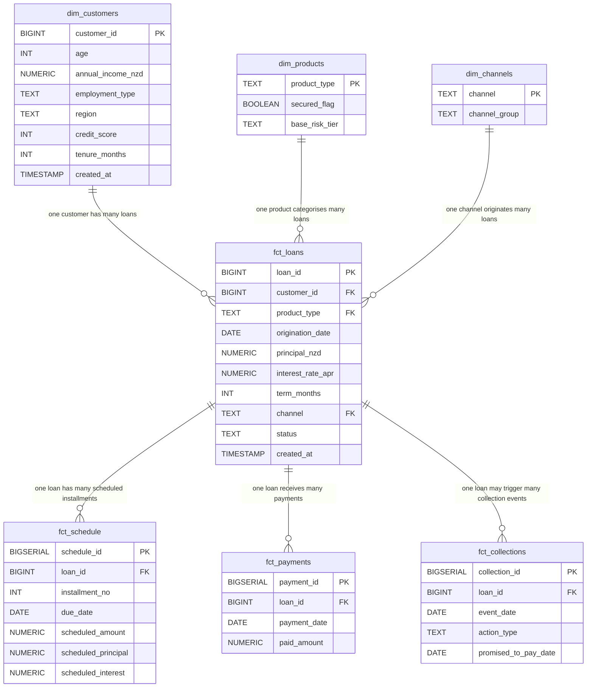

# Data Model

## Entity-Relationship Diagram

## Schema

All tables reside in the `loan_analytics` schema within PostgreSQL.

## Dimension Tables

### dim_customers

**Grain:** One row per customer.

| Column | Type | Description | Example |
|---|---|---|---|
| customer_id | BIGINT (PK) | Unique customer identifier | 1 |
| age | INT | Customer age at onboarding | 34 |
| annual_income_nzd | NUMERIC(12,2) | Gross annual income in NZD | 72,500.00 |
| employment_type | TEXT | Employment category | Salaried |
| region | TEXT | NZ region of residence | Auckland |
| credit_score | INT | Credit score at onboarding (450-850) | 680 |
| tenure_months | INT | Months as customer | 24 |
| created_at | TIMESTAMP | Row creation timestamp | 2024-01-15 10:30:00 |

**Employment types:** Salaried, Self-employed, Contractor, Student, Unemployed

**Regions:** Auckland, Wellington, Canterbury, Waikato, Bay of Plenty, Otago, Manawatu, Other

### dim_products

**Grain:** One row per product type.

| Column | Type | Description | Example |
|---|---|---|---|
| product_type | TEXT (PK) | Product category | Personal |
| secured_flag | BOOLEAN | Whether the product is secured by collateral | false |
| base_risk_tier | TEXT | Default risk classification | High |

**Product universe:**

| Product | Secured | Risk Tier | Typical APR | Typical Term |
|---|---|---|---|---|
| Personal | No | High | ~16.9% | 12-48 months |
| Auto | Yes | Medium | ~11.9% | 24-60 months |
| Mortgage | Yes | Low | ~7.2% | 120-300 months |
| SME | No | High | ~14.9% | 12-36 months |

### dim_channels

**Grain:** One row per origination channel.

| Column | Type | Description | Example |
|---|---|---|---|
| channel | TEXT (PK) | Origination channel | Online |
| channel_group | TEXT | Direct or Indirect classification | Direct |

**Channel universe:**

| Channel | Group | Portfolio Share |
|---|---|---|
| Online | Direct | ~35% |
| Broker | Indirect | ~30% |
| Branch | Direct | ~20% |
| Partner | Indirect | ~15% |

## Fact Tables

### fct_loans

**Grain:** One row per loan.

| Column | Type | Description | Example |
|---|---|---|---|
| loan_id | BIGINT (PK) | Unique loan identifier | 100001 |
| customer_id | BIGINT (FK) | References dim_customers | 42 |
| product_type | TEXT (FK) | References dim_products | Auto |
| origination_date | DATE | Loan funding date | 2023-06-15 |
| principal_nzd | NUMERIC(14,2) | Original loan amount in NZD | 35,000.00 |
| interest_rate_apr | NUMERIC(6,4) | Annual percentage rate | 0.1190 |
| term_months | INT | Contracted loan term in months | 48 |
| channel | TEXT (FK) | References dim_channels | Broker |
| status | TEXT | Loan status | Active |
| created_at | TIMESTAMP | Row creation timestamp | 2024-01-15 10:30:00 |

### fct_schedule

**Grain:** One row per loan per installment (one scheduled payment).

| Column | Type | Description | Example |
|---|---|---|---|
| schedule_id | BIGSERIAL (PK) | Auto-generated row identifier | 1 |
| loan_id | BIGINT (FK) | References fct_loans | 100001 |
| installment_no | INT | Installment sequence number (1-indexed) | 6 |
| due_date | DATE | Payment due date | 2023-12-15 |
| scheduled_amount | NUMERIC(14,2) | Total scheduled payment (principal + interest) | 878.50 |
| scheduled_principal | NUMERIC(14,2) | Principal portion of the installment | 612.30 |
| scheduled_interest | NUMERIC(14,2) | Interest portion of the installment | 266.20 |

### fct_payments

**Grain:** One row per payment event (a loan may have multiple payments per period, e.g. partial + top-up).

| Column | Type | Description | Example |
|---|---|---|---|
| payment_id | BIGSERIAL (PK) | Auto-generated row identifier | 1 |
| loan_id | BIGINT (FK) | References fct_loans | 100001 |
| payment_date | DATE | Actual payment date | 2023-12-18 |
| paid_amount | NUMERIC(14,2) | Amount paid | 878.50 |

### fct_collections

**Grain:** One row per collections action event.

| Column | Type | Description | Example |
|---|---|---|---|
| collection_id | BIGSERIAL (PK) | Auto-generated row identifier | 1 |
| loan_id | BIGINT (FK) | References fct_loans | 100001 |
| event_date | DATE | Date the collections action occurred | 2024-01-05 |
| action_type | TEXT | Type of collections action | Call |
| promised_to_pay_date | DATE | Customer's commitment date (if applicable) | 2024-01-20 |

**Action types:** SMS, Call, Email, Agent, Hardship

## Optional Table

### dim_macro_monthly

Not populated by the data generator but included in the schema for future use (e.g. macro-overlay models).

| Column | Type | Description |
|---|---|---|
| month | DATE (PK) | First day of month |
| unemployment_rate | NUMERIC(6,4) | Monthly unemployment rate |
| cpi_index | NUMERIC(10,4) | Consumer price index |
| cash_rate | NUMERIC(6,4) | Official cash rate |

## Indexes

| Index | Table | Column(s) | Purpose |
|---|---|---|---|
| idx_loans_customer | fct_loans | customer_id | Join performance to dim_customers |
| idx_loans_origdate | fct_loans | origination_date | Date range filtering |
| idx_schedule_loan_due | fct_schedule | loan_id, due_date | Scheduled vs paid joins |
| idx_payments_loan_date | fct_payments | loan_id, payment_date | Payment lookups by loan + date |
| idx_collections_loan_date | fct_collections | loan_id, event_date | Collections history lookups |
